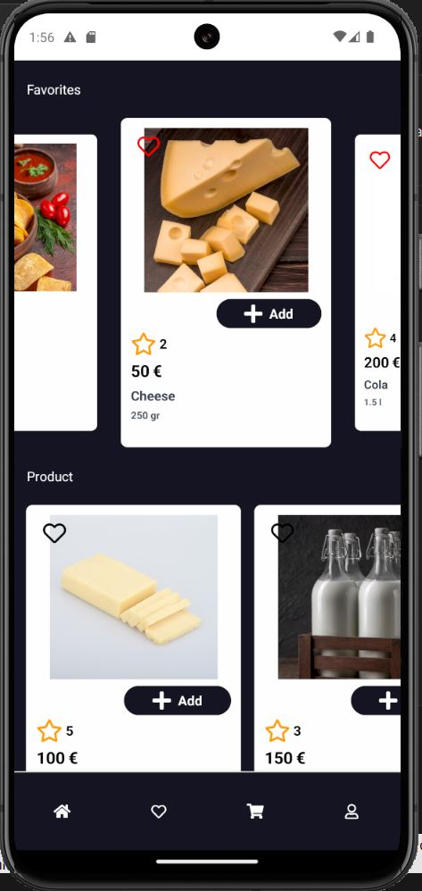
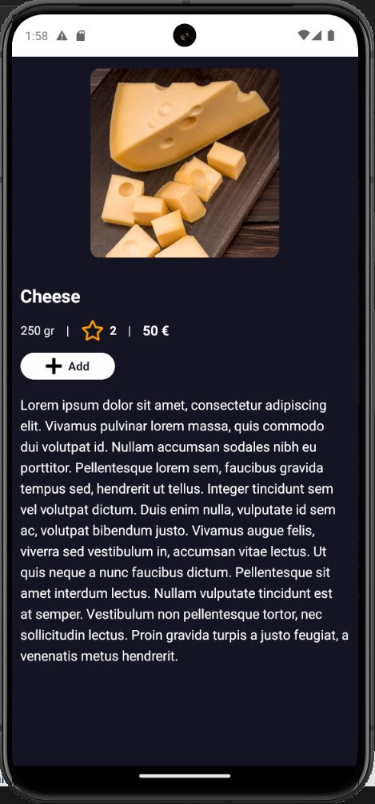
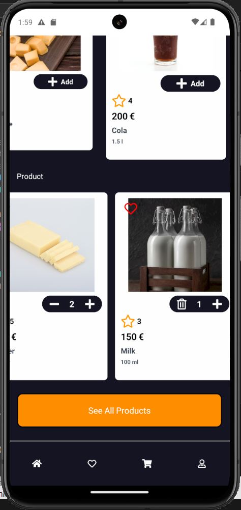
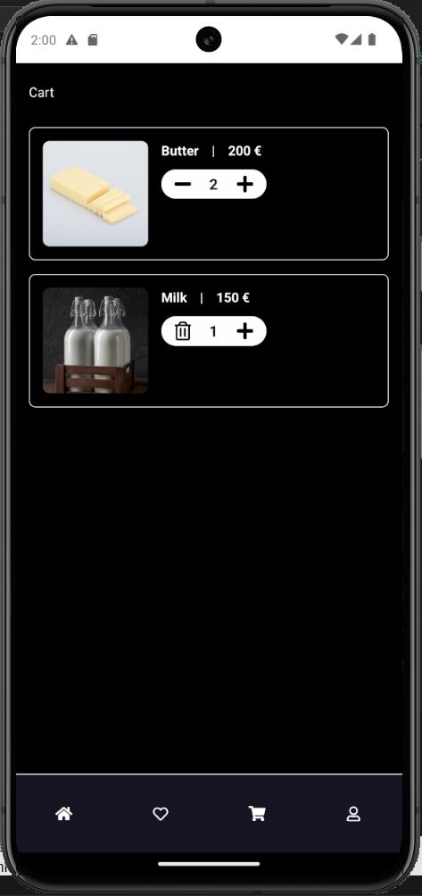
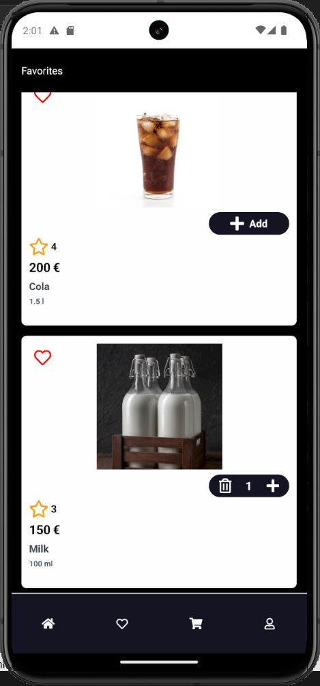

## Description
This project is a sample application built with React Native(Expo). It demonstrates how to display a list of products. The application provides product details and a cart for adding products and selecting favorites. 

## Screenshots

<div style="display: flex; flex-direction: row; gap: 10px; flex-wrap: wrap;">









</div>


## Project Setup
# Install **Dependencies**
```bash
$ npm install
```

## Running the Project
```bash
# development
$ npm run start
```
## Author
[Saman Kefayatpour](https://www.linkedin.com/in/samankefayatpour/)
